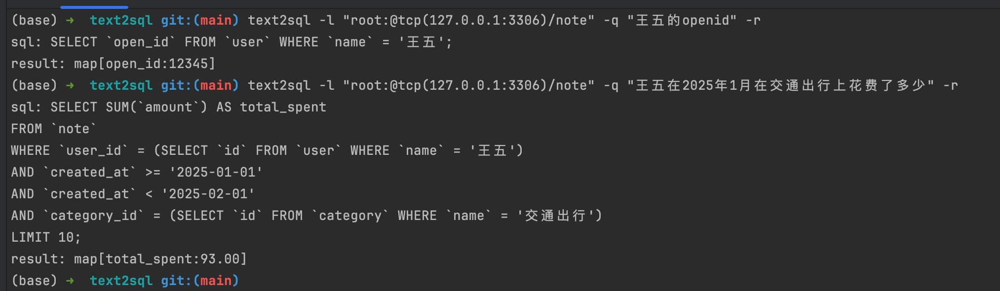

# Text2SQL

一个基于自然语言处理的工具，可以将自然语言转换为对应的SQL查询语句。

## 功能特点

- 支持将中文自然语言转换为SQL查询语句
- 自动验证生成的SQL语句的正确性
- 支持多次重试以提高成功率
- 可选择是否执行生成的SQL语句

## 安装

```bash
go get github.com/wangle201210/text2sql
```

## 使用方法

### 基本用法

```go
package main

import (
    "github.com/wangle201210/text2sql"
    "fmt"
)

func main() {
  cfg := &text2sql.Config{
    DbLink:    "root:password@tcp(127.0.0.1:3306)/database?charset=utf8mb4&parseTime=True&loc=Local",
    Try:       5,      // 失败时的重试次数
    ShouldRun: true,   // 是否执行生成的SQL
    Times:     3,      // 同时生成3个SQL，选择最合适的一个
    // OnlyView: true,    // 只查询view结构，使用view提高查询效果
  }
  newEino, err := eino.NewEino(&openai.ChatModelConfig{
    APIKey:  os.Getenv("OPENAI_API_KEY"), // sk-******
    BaseURL: os.Getenv("OPENAI_BASE_URL"), // https://api.openai.com/v1
    Model:   os.Getenv("OPENAI_MODEL_NAME"), // gpt-4o-mini
  })
  if err != nil {
    log.Fatalf("NewEino err: %+v", err)
    return
  }
  ts := text2sql.NewText2sql(cfg, newEino)
  sql, result, err := ts.Pretty("王五在2025年1月上旬的餐饮食品类别总额")
  if err != nil {
    log.Fatalf("text2sql err: %+v", err)
  }
  fmt.Printf("sql: %s \n", sql)
  if run {
    fmt.Printf("result: %+v \n", result)
  }
}
```

### 配置说明

- `DbLink`: MySQL数据库连接信息
- `Try`: SQL生成失败时的重试次数
- `ShouldRun`: 是否执行生成的SQL语句
    - 设置为`true`时会执行SQL并返回结果
    - 设置为`false`时只返回生成的SQL语句
- `Times`: 同时生成SQL的次数（可选，默认1）
    - 取值范围：1-10
    - 数值越大，生成的SQL候选数越多，选择最合适的SQL的准确率越高
    - 注意：数值越大消耗的token也越多
- `OnlyView`: 只使用view结构，使用view提高查询效果
- `OnlyTable`: 只使用table结构，不加载view


## 命令行工具
[命令行工具](./cmd/text2sql/README.md)


## 注意事项

1. 确保数据库连接字符串中包含正确的用户名、密码和数据库名
2. 建议在生产环境中适当设置重试次数，避免过多重试
3. 如果只需要生成SQL而不执行，请将`ShouldRun`设置为`false`
4. 用例的数据在[note20250226.sql.zip](./note20250226.sql.zip)

## 依赖

- gorm.io/gorm
- gorm.io/driver/mysql
- github.com/cloudwego/eino

## 许可证

MIT License
